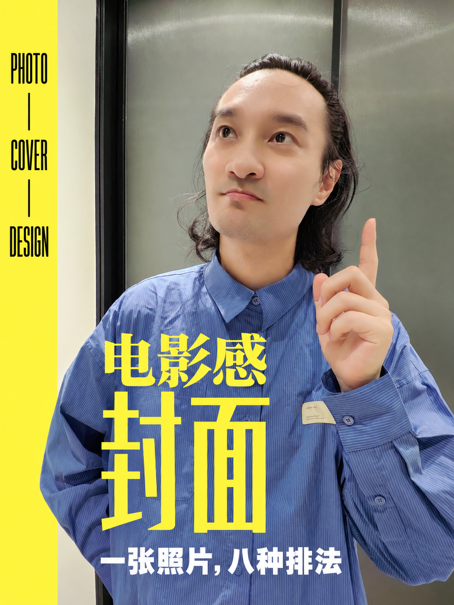
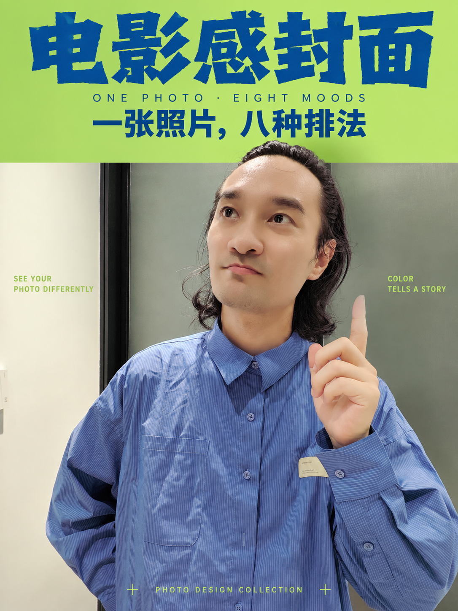
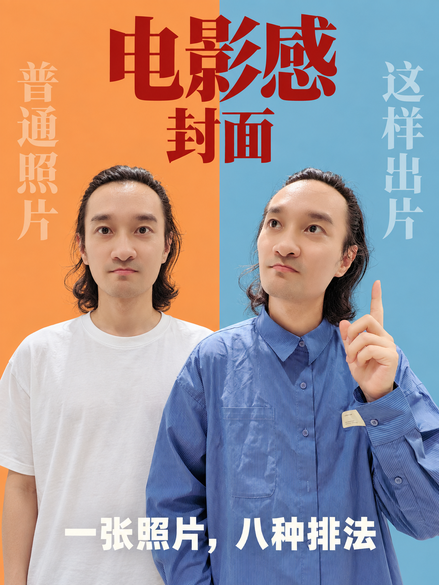
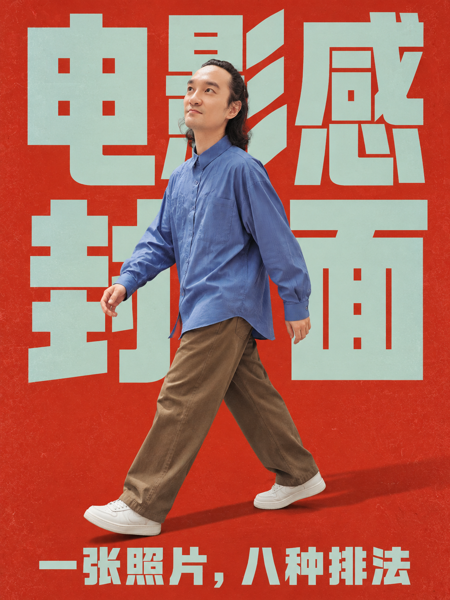
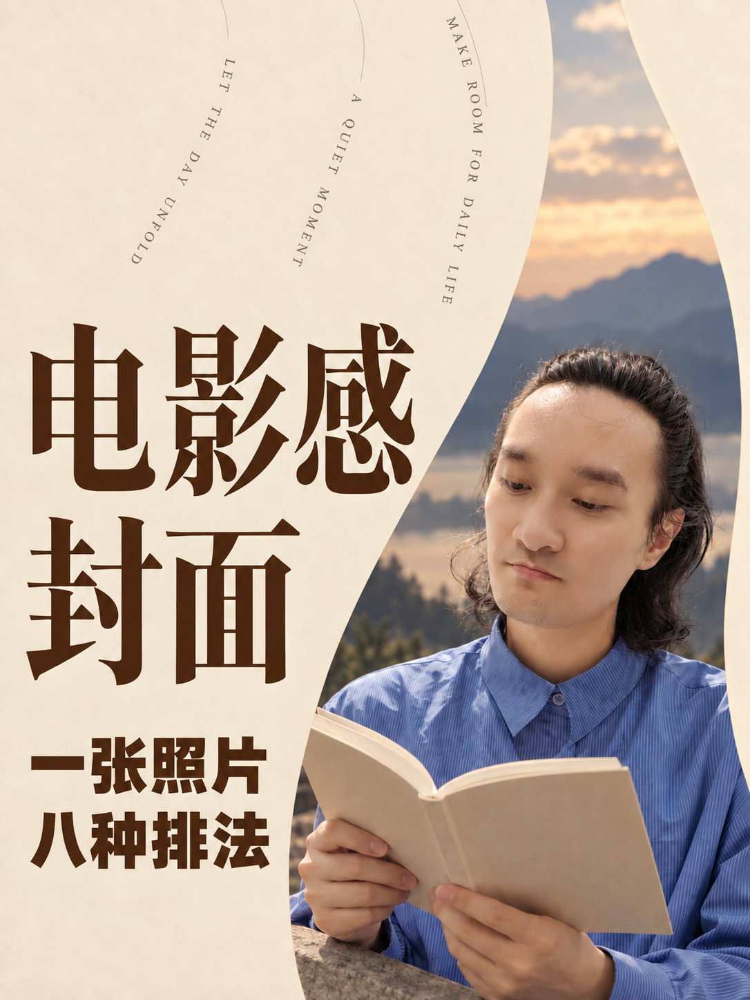

# 书生·色块封面八式

**一个色块，八种电影感封面。**

上传自己的人物照片，添加 Skill，写一组标题与副标题，就可以尝试八种独立封面。色块、字体、人物关系与检查要求已整理在文件中。

[下载 SKILL.md](https://github.com/gafata168-cell/photo-cover-color-eight/raw/refs/heads/main/SKILL.md) · [完整图文教程](https://my.feishu.cn/wiki/SK3UwYwsni5wk8kNWy2cyvhJnGc) · [工具与教程合集](https://my.feishu.cn/wiki/SAsPwn7j9iAZxkkJBWVcM80OnSd) · [第一期六式](https://github.com/gafata168-cell/photo-cover-six)

## 八种效果

以下为视频使用的 GPT 精选展示图，用于说明设计方向。即梦验证与 GPT 展示分开记录；生成存在随机性，不承诺一次复刻全部效果。

| 01 侧边色块 | 02 绿底上下 |
|---|---|
|  |  |

| 03 透视边框 | 04 橙蓝对照 |
|---|---|
|  |  |

| 05 红底巨字 | 06 巨字空间 |
|---|---|
|  |  |

| 07 橙色撕纸 | 08 米色曲线 |
|---|---|
|  |  |

## 即梦演示：照片 + Skill + 一句话

1. 下载上方 `SKILL.md`，保留 `.md` 格式。
2. 打开[即梦](https://jimeng.jianying.com/ai-tool/home)，进入画布，添加自己的照片和 Skill 文件。
3. 使用演示配置「图片 5.0 Pro / Seedream 5.0 Pro」，3:4、2K。模型权限、会员与积分以当前账号页面为准，下载文件不附带模型额度。
4. 发送以下提示词，八款共用一组文案：

```text
用这个 Skill，把我上传的照片做成八种独立封面。主标题“电影感封面”，副标题“一张照片，八种排法”。
```

也可说“只生成第 08 款米色曲线”，先试自己喜欢的一款。照片应五官清楚；前3款主要保留原动作，后5款按设计调整动作与场景，均应保留本人外貌。

## 我自用较多的是 Codex

这期操作演示使用即梦，我自己也经常用 Codex 讨论和生成封面。在具备 GPT 图片生成工具的 Codex 中，提供照片与本文件，发送：

```text
请使用 GPT 图片生成，按照这个 Skill 把我的照片做成八张独立封面。主标题“电影感封面”，副标题“一张照片，八种排法”。
```

实际模型和尺寸服从当前工具支持；只有文字能力的对话无法直接输出图片。

## 检查与迭代

放大看错字、脸和手，再缩到手机大小检查标题。失败时只重跑对应款式，并指出位置与问题。第08款应为两行横排主标题、深棕粗黑体副标题、弯曲英文和右侧阅读人物；不要接受单列竖标题或白色小副标题。

想做自己的风格，可将喜欢的参考图、Skill 与赛道需求一起交给 AI，让它保留现有样式并新增一款，再换照片和文案测试。预览图供效果参考，日常输入自己的原照即可。

## 使用与分享

作者：**书生今天也在学**。允许免费使用、修改及为客户做图；分享须保留作者与来源，修改版注明修改；禁止把文件及沿用内容包装成付费资源销售。生成图无需作者水印。完整条款见 [LICENSE.md](LICENSE.md)。本项目为附条件免费源码分享。

## 交流与反馈


当前群码标注 **2026年9月27日前有效**。失效时请到[工具与教程合集](https://my.feishu.cn/wiki/SAsPwn7j9iAZxkkJBWVcM80OnSd)查看最新入口。使用问题可在 Issues 中附平台、模型及具体问题。当前使用公共交流群，俱乐部入口后续另行更新。
